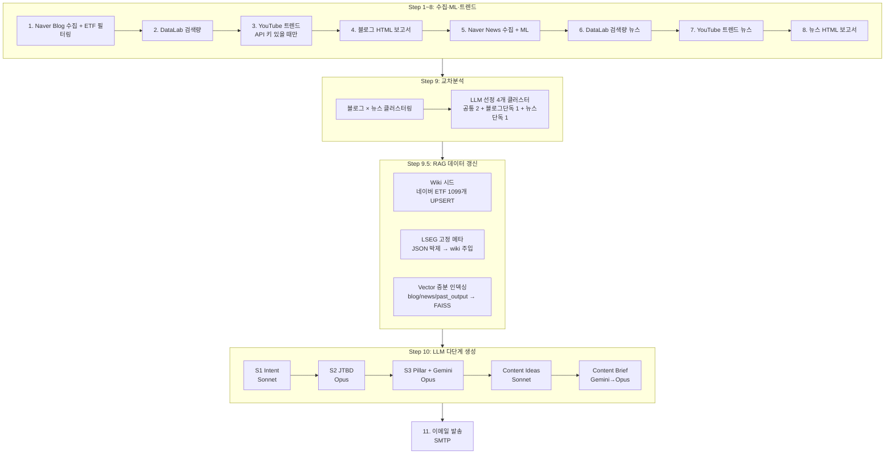
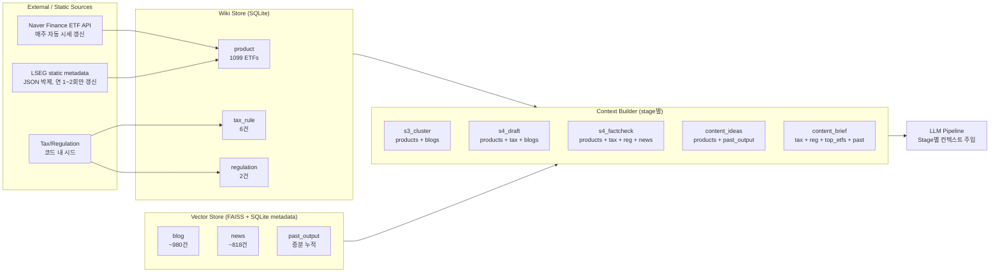
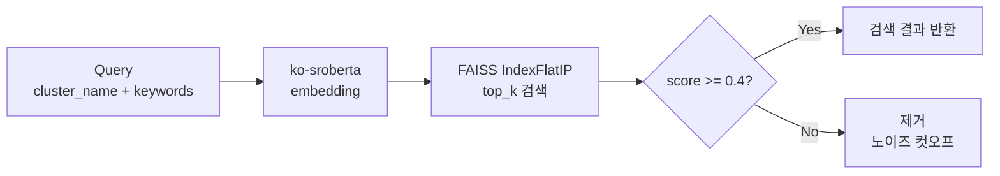
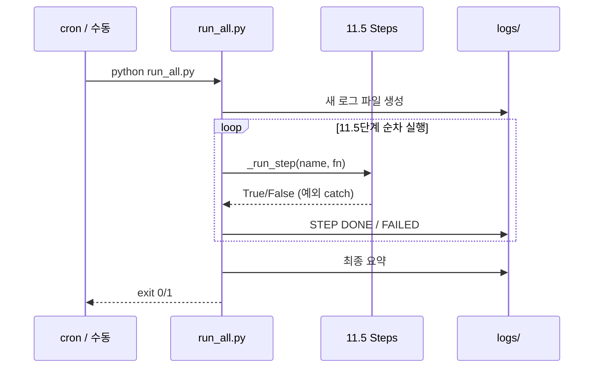

# Architecture

전체 파이프라인은 단일 진입점 `python run_all.py` 로 11.5단계가 순차 실행됩니다. 각 단계는 독립적이며, 한 단계가 실패해도 다음 단계는 계속 시도합니다 (`_run_step` 래퍼).

## High-level Flow

## RAG Layer Detail

## Vector Search Quality Cutoff

자세한 컷오프 임계값 결정 근거: [ADR-003](adr/003-vector-noise-cutoff.md)

## Storage Layout

| Path | Purpose | Lifecycle |
|---|---|---|
| `etf_trend.db` | Blog ML + Wiki + RAG metadata 통합 | 매주 갱신 (UPSERT) |
| `etf_trend_news.db` | News ML | 매주 갱신 |
| `data/rag/{blog,news,past_output}.faiss` | Vector 인덱스 | 증분 누적 |
| `data/lseg_static_metadata.json` | LSEG 고정 메타 (1099 종목) | 연 1~2회 갱신 |
| `data/processed/filtered_docs.json` | ETF 관련 필터링된 블로그 코퍼스 | 매주 갱신 |
| `output/YYYY-MM-DD/` | 주간 산출물 (HTML + JSON) | 매주 누적 |
| `logs/run_*.log` | 실행 로그 | 매주 누적 |

## Key Architecture Decisions

각 결정의 trade-off와 이유:

- [ADR-001: SQLite + FAISS 조합 (Graph DB 미도입 이유 포함)](adr/001-storage-choice.md)
- [ADR-002: LSEG 메타데이터 JSON 박제 패턴](adr/002-lseg-snapshot-pattern.md)
- [ADR-003: Vector 검색 score 0.4 컷오프](adr/003-vector-noise-cutoff.md)
- [ADR-004: 왜 RAG, 왜 Fine-tuning이 아닌가](adr/004-rag-over-finetuning.md)

## Run Topology

